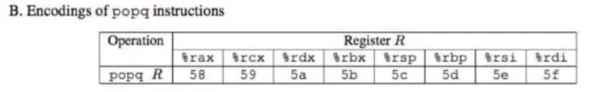
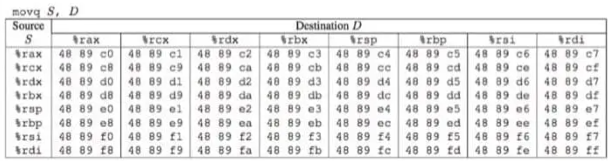

## note
- 总览`main`，main -> launch -> test -> getbuf
- [参考：小土刀/厚读CSAPP](https://www.wdxtub.com/blog/csapp/thick-csapp-lab-3)  
了解 code-injection 和 ROF(return-oriented programming)

## ctarget(code-injecton)
### touch_1
- 输入应在一行，因为读取到换行符截止
- 注意小端法机器

### touch_2
- Linux x86-64传参顺序  
第1-6个：`%rdi` `%rsi` `%rdx` `%rcx` `%r8` `%r9`  
后续参数：使用栈保存
- `touch2` 比较`rdi`和`cookie`，所以我们要将`rdi`设为`cookie`，并在注入后跳转到`touch2`
- 由于我们的输入放在`getbuf`的缓存区，可在`getbuf`时`p $rsp`查看注入代码的起始地址，像`touch1`一样，使缓存区溢出更改跳转地址为缓冲区起始地址，代码执行`mov $0x59b997fa,%edi`
- 将`rdi`设为`cookie`后需要跳转回`touch2`，我们知道调用函数会将返回地址储存到栈顶上，`ret`会跳回该地址，所以我们应将栈顶储存的地址改为`touch2`的，即将`touch2`的地址压入栈中

### touch_3
- 一元 `imul`，第二个因子为`ax/eax/rax`
- 使用绝对地址下断点：`b *0x40188d`  
或使用相对地址：`b *hexmatch+0x41`（更稳，避免地址漂移）
- 与`touch2`相比，有`push`、`call`等等，会该改变缓存区的值
- 注入代码一开始用rdi保存cookie指针，再将touch3的地址压入栈中  
填充缓冲区，将上一次ret值覆盖为指向注入代码起始地址，执行我们的注入代码  
在调用`touch3`时，`touch3`使用`push`，`call`等，会覆写缓冲区，即将覆写`rdi`里的指针`0x5560f318`，寻找不会被覆写的地址储存cookie，再用rdi储存改地址，即可解决问题

## rtarget(ROF)
- 与`ctarget` 相比，stack不可执行，`code-injection`不起作用
- 使用`ROF`，即使用已有代码片段，通过栈溢出等手段，将返回地址连接成一串`gadgets`

### touch1
- 与`ctarget touch1`相似，将ans1输入进去，发现虽然启用`touch1`但是报错，使用`gdb`调试，发现问题出在`movaps %xmm0,-0x40(%rbp)`
- `movaps`要求按16字节对齐，进入`touch1`后`p/x $rsp`可以发现末尾是`0x8`
- 所以要使栈多弹出8个字节，或压入8个字节
- 这里选择多弹出8个字节，则第一次`ret`可以选择先跳转到一个没有产生影响的函数(这里选择`end_farm`)，然后像先前操作一样利用栈缓冲更改第二次`ret`的地址（即`touch1`的地址）
- 最后答案就是 40缓冲字节+8字节`end_farm`地址+8字节`touch1`地址

### touch2
- 要将`rdi`设为`cookie`，查看`farm.s`，没有直接的`mov`
- 于是想到通过`pop`指定数值，查看`encoding of popq instruction`  
 
查找`[58-5f] c3`，发现有`pop %rax`，记录地址
- 之后需要将`rax`移到`rdi`，查看`encoding of movq instruction`  

查找`48 59 c7 c3`，成功找到，记录地址，再跳转到`touch2`即可，注意16字节对齐
- 最后答案：40缓冲字节+8字节`pop %rax`指令地址+8字节`cookie`数值(被`pop`部分)+8字节`mov %rax,%rdi`指令地址+`touch2`地址  
恰好满足16字节，否则类似`touch1`多弹出8字节即可

### touch3
- `x/i $rip`打印当前指令
- 将`cookie`的ACSII码放入缓存中，使`rdi`保存其地址传给`hexmatch`  
我们可以先记下`getbuf`返回后的`rsp`，再记录偏移值，来得到cookie地址  
`rsp`:`mov rsp,xxx`,查表搜寻可以发现可以存在`rax`中，且从`touch2`可知有`mov %rax,%rdi`，成功取到`rsp`  
偏移值：类似`touch2`可以用`pop %rax`指定偏移值，然后需要`lea (%rdi,%rax,1),%rdi`，查找没有，但是有`lea (%rdi,%rsi,1),%rax`  
需要将`rax`移到`rsi`,发现无法从64位下手，于是考虑32位，发现可以`eax - edx - ecx - esi`  
由于`cookie`放在缓存区，偏移量为负的，但是`esi`为32位，`rdi`位64位，无法正确偏移  
想办法扩展`esi`，失败；想办法使用64位寄存器传递，失败；查找其他办法扩展32位寄存器，失败，崩溃；  
只能使偏移量为正，将`cookie`放在栈底，即`ret touch3`后，在退出`getbuf`和进入`touch3`时分别`p/x $rsp`即可知道偏移量
- 答案：  
40字节填充缓存区  
`mov %rsp,%rax`  
`mov %rax,%rdi`  
`pop %rax`  
偏移量  
`mov %eax,%edx`  
`mov %edx,%ecx`  
`mov %ecx,%esi`  
`lea (%rdi,%rsi,1),%rax`  
`mov %rax,%rdi`  
`touch3`地址  
`cookie`ACSII码
- 注意16字节对齐